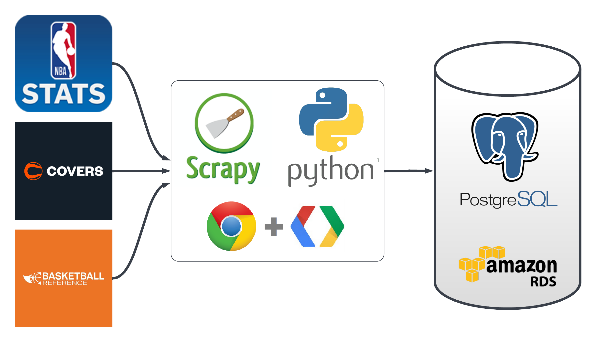
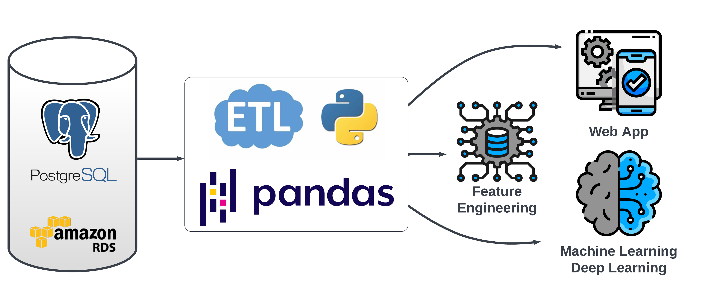
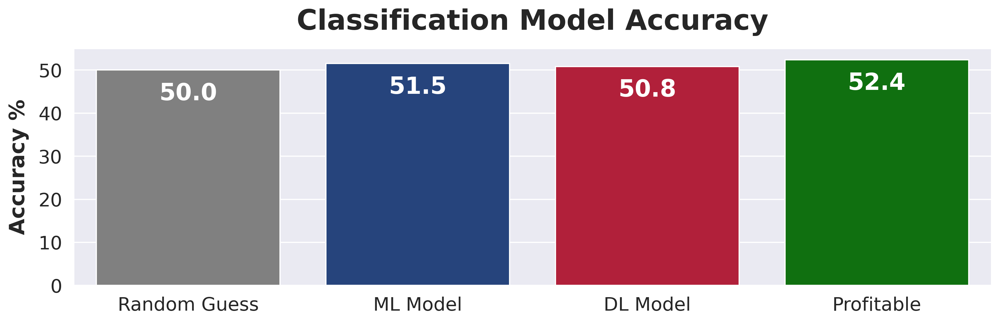
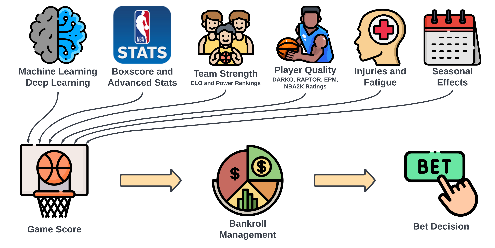
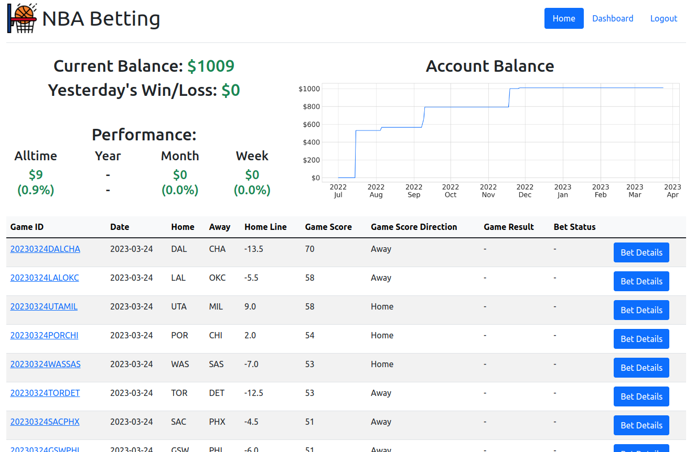
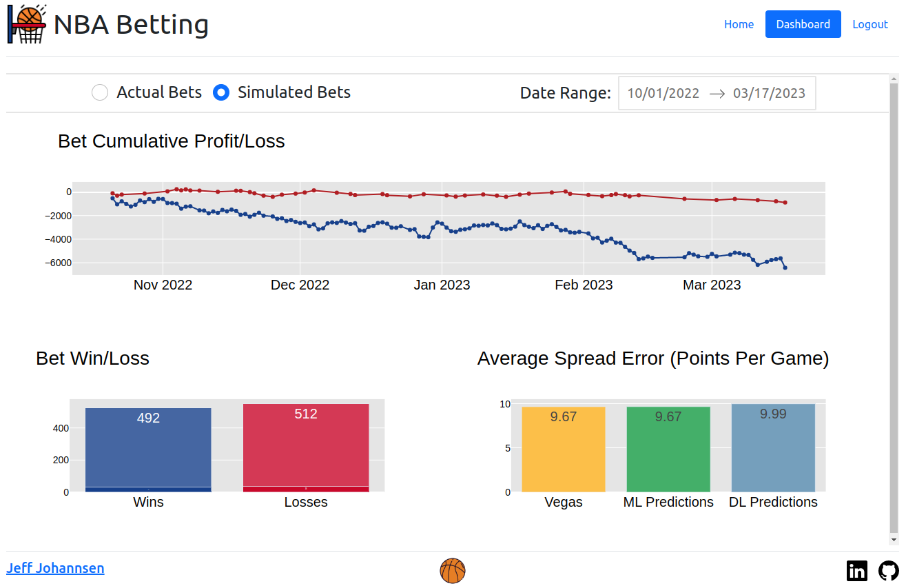

# NBA Betting

## Version 1: Team-Game Focused Predictions (Current)

Predictions based on modeling of team performance as a whole using team level statistics.
Main focus was on creating an end to end project architecture and determining a baseline performance.
* Completed: March 2023
* Performance: Approximately Even Money 

## Version 2: Player-Game Focused Predictions (In Development)
Predictions based on modeling of player performance combined with player interactions and whole team performance.
This takes into account predictors that were ignored by version 1. Most importantly player availability.
Main focus is on the prediction engine architecture and model performance.
* Completion Goal: October 2023
* Performance: TBD

### Outline of Version 2
**Player Prediction Framework** - Combination of ML/DL and Traditional Algorithms used to predict the performance of individual players.
**Player Interaction and Synergy Framework** - Focused on understanding and predicting the performance of players in various combinations on and off the court.
Example: How does Steph Curry perform when Draymond Green is on the court vs off the court?
**Team Prediction Framework** - Combination of ML/DL and traditional algorithms used to predict the performance of teams as a whole.
**Game Prediction Framework** - Betting market data and other misc predictors of game outcomes.
**Prediction Framework Integration** - Combining the 4 prediction frameworks into a single bet management system. Final testing, organization, and cleanup. Full deployment to the web app.

## Table of Contents
* [Introduction](#Introduction)
* [Data Engineering](#Data-Engineering)
* [Exploratory Data Analysis](#Exploratory-Data-Analysis)
* [AutoML](#AutoML)
* [Bet Decision](#Bet-Decision)
* [Deployment](#Deployment)
* [Next Steps](#Next-Steps)
* [Contact](#Contact)
* [Acknowledgments](#Acknowledgments)

  

# Introduction

## Goal

The goal of this project is to create a profitable system for betting on NBA basketball games by leveraging data science and machine learning.

## Motivation

NBA betting sits at an intersection of my interests, knowledge, skills, and goals which makes it a project that is both beneficial and exciting for me. A lucky combination!
* NBA - Huge fan of professional basketball. Especially since 2015. Main focus is on the analytical and financial aspects of the league.
* Data Science - Past Education and Current Career Focus. 
* Sports Stats - Lifelong interest starting with baseball and moving into other sports.
* Investing - Education in Finance - Sportsbetting as an investment option.

## Plan

### How to predict a NBA game result?
|             |             |             |
| ----------- | ----------- | ----------- |
|All in One Team and Player Advanced Stats<ul><li>RAPTOR - FiveThirtyEight</li><li>DARKO - The Athletic</li><li>LEBRON - BBall Index</li><li>EPM - Dunks and Threes</li></ul>|Long-Run Team Quality and Opponent Quality<ul><li>Traditional Box Score Stats</li><li>Advanced Stats</li><li>Elo Ratings</li><li>Power Rankings</li></ul>|Recent Team Performance<ul><li>Last 3, 5, 10, 20 Days</li><li>Game Results</li><li>Traditional Stats</li><li>Advanced Stats</li><ul>|
|Injuries, Rest, Fatigue<ul><li>Estimated Performance % for Players - Injury % and Fatigue %</li><li>Schedule Effects - Back2Backs, 3 Games in 4 Nights</li></ul>|Game Location<ul><li>Home vs. Road Adjustment</li><li>Altitude Effects for Denver and Utah</li></ul>|Seasonal Effects<ul><li>Tanking for Draft Position</li><li>Playoff Seed Positioning</li></ul>|

  

# Data Engineering

## Data Acquisition and Storage

## ETL

  

# Exploratory Data Analysis

## Average Vegas Point Spread Error Per Game Over Time

There is a possibility for improvement over the vegas lines for NBA games. The average miss for the vegas line vs the actual game result is over 9 points since 2006!

  

# AutoML

Baseline Machine Learning and Deep Learning Model Accuracy is greater than chance but less than what is necessary to be profitable after accounting for the vig (Sportsbook cut for taking bet). This is not troubling for two reasons:
1. Current models and feature set are very simple. Improved models and enhanced feature set coming in the future.
2. Model predictions are only a part of the overall bet decision.

  

# Bet Decision

  

# Deployment

## Web App

### Link >>> [http://nba-betting.us/](http://nba-betting.us/)  
** Publically available data is for example only. It does not reflect actual predictions or bet recommendations at this time.

  

# Next Steps

Version 2: Player-Game Focused Predictions
* Modeling and Prediction Architecture Planning
    * Determine what I can get historical data for.
    * Design how Player-Game(V2) outputs will be integrated into Team-Game(V1) outputs? 
    * Choose Modeling Strategy (Model per Player, Model per Position, All Player Model, Combinations and Transfer Learning)
    * Evaluate Possible Feature Categories (Direct Statistics, Index/Advanced Statistics, Subjective Quality Ratings, Categorizers/Modifiers, Other)

Other
* Add HTTPS to Web App

  

# Contact

Jeff Johannsen - [LinkedIn](https://www.linkedin.com/in/jeffjohannsen/)

  

# Acknowledgments

## Data

* [Covers](https://www.covers.com/) - Main source of odds data both live and historic.
* [NBA Stats](https://www.nba.com/stats) - Main source of NBA data.
* [Basketball Reference](https://www.basketball-reference.com/)
* [FiveThirtyEight](https://fivethirtyeight.com/)

## Helpful Projects

* [Databall](https://github.com/klane/databall)

## Tools

Python
* Pandas
* Matplotlib
* Seaborn
* SQLAlchemy
* PyCaret
* AutoKeras
* Keras
* Tensorflow
* Scikit-Learn
* Flask
* Plotly Dash
* Scrapy
* Scrapy Splash  

SQL
* Postgres

AWS
* EC2
* RDS

Other
* Cron/Crontab
* HTML/CSS/JS
* Bootstrap
* Chrome Dev Tools
