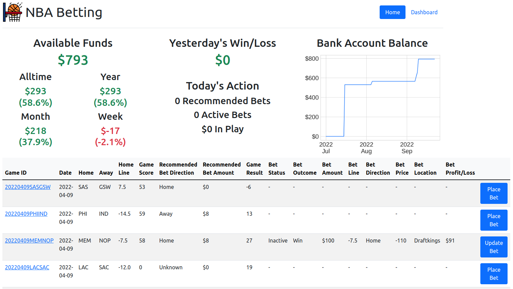
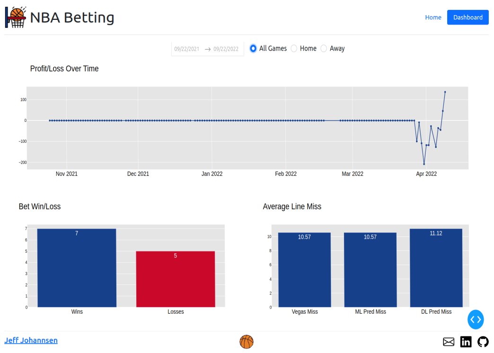

# NBA Betting

## Table of Contents
* [Introduction](#Introduction)
* [Data Engineering](#Data-Engineering)
* [Exploratory Data Analysis](#Exploratory-Data-Analysis)
* [AutoML](#AutoML)
* [Bet Decision](#Bet-Decision)
* [Deployment](#Deployment)
* [Next Steps](#Next-Steps)
* [Contact](#Contact)
* [Acknowledgments](#Acknowledgments)

  

# Introduction

## Motivation

Sports Stats - MLB, Sports Game Simulations, Personal Sports League Record Keeping (Papers from Childhood)
NBA - Steph Curry and 2015-2016 Warriors, Why I think NBA is the best league in sports
Investing - Sports Betting as an investment??

## Goal

The main goal of this project is create an automated system that collects data about NBA games and predicts point spreads at a level that is consistently profitable.

## Plan

How I plan on achieving the goal. Action Plan Data Info

  

# Data Engineering

* Needed historic data for models. Data points as of a date in the past. More difficult to locate.
* Combined historic data with current data via daily cron jobs.

## Data Acquisition and Storage

## ETL

  

# Exploratory Data Analysis

Dataprep.eda for AutoEDA

Interesting Questions:
* Vegas Point Spread vs. Actual Game Spread over time. How has Vegas improved at predicting?
* Biggest Outliers Vegas vs. Actual
* Home vs. Road over time
* Home/Road against the spread over time
* How much is being at home worth over time, Both vegas lines and actual results
* Team Quality vs. Against the Spread results. Are good, average, or bad teams more likely to over-perform the vegas spread?
* Actual Team Record vs. Expected Record, Which is a better predictor of vegas lines and actual results?

## Average Point Spread Error Per Game Over Time

  

# AutoML

  

# Bet Decision

At the end of the day you win or loss money based on which bets you place. Below is an outline of the formula I use to determine whether to bet on a particular game or not.

  

# Deployment

## Web App

  

# Next Steps

* Add premier NBA advanced stats like DARKO, RAPTOR, and EPM to feature set and prediction models.
* Test more Deep Learning model constructs.
* Live test project on 2022-2023 NBA Season starting October 18th.

  

# Contact

Jeff Johannsen - [LinkedIn](https://www.linkedin.com/in/jeffjohannsen/) - jeffjohannsen7@gmail.com

  

# Acknowledgments

## Data

* [Covers](https://www.covers.com/) - Main source of odds data both live and historic.
* [NBA Stats](https://www.nba.com/stats) - Main source of NBA data.
* [Basketball Reference](https://www.basketball-reference.com/)

## Helpful Projects

* [Databall](https://github.com/klane/databall)

## Tools

Python
* Scrapy
* Splash
* Pandas
* SQLAlchemy
* PyCaret
* Keras
* Tensorflow
* Scikit-Learn
* Flask
* Plotly Dash  

SQL
* Postgres

AWS
* EC2
* RDS

Other
* Docker
* Cron/Cronitor
* HTML/CSS
* Bootstrap
* Chrome Dev Tools

