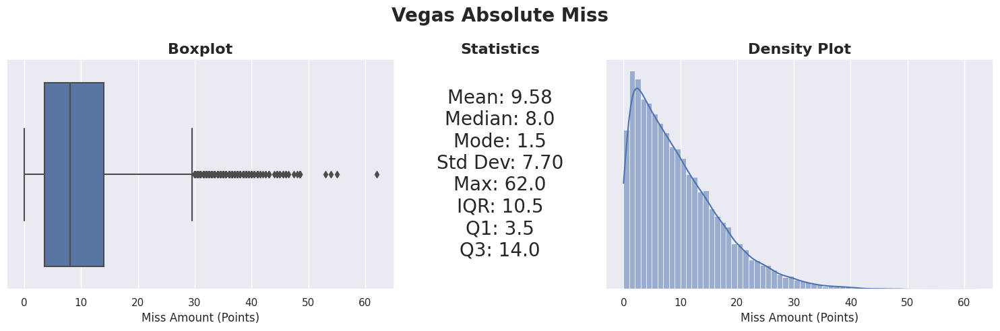
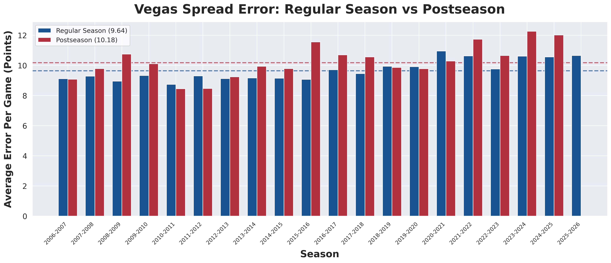
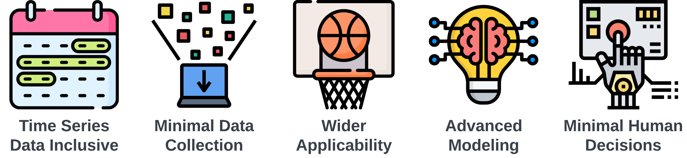
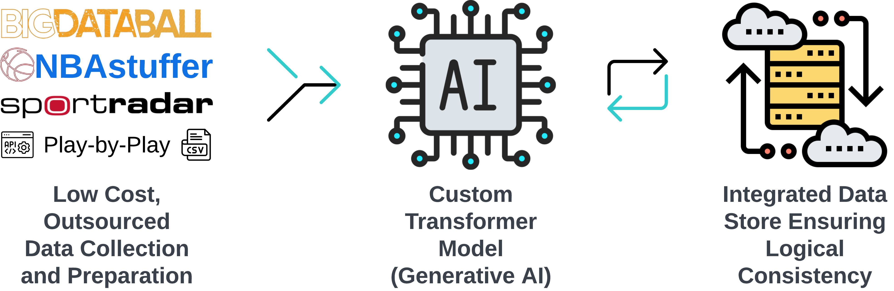

# NBA Betting

## Table of Contents
- [Introduction](#introduction)
  - [Project Goal](#project-goal)
  - [Motivation](#motivation)
  - [Plan](#plan)
- [Current Goal](#current-goal)
- [Project Structure](#project-structure)
  - [Data Sourcing and Storage](#data-sourcing-and-storage)
  - [Data Prep and Feature Engineering](#data-prep-and-feature-engineering)
  - [Exploratory Data Analysis](#exploratory-data-analysis)
  - [ML/DL Modeling](#mldl-modeling)
  - [Custom Model Architecture](#custom-model-architecture)
  - [Bet Decisions](#bet-decisions)
  - [Web App and Dashboard](#web-app-and-dashboard)

# Introduction

## Project Goal
Create a **Comprehensive** and **Profitable** System for Predicting the **Outcomes** of NBA Games.

#### Comprehensive Approach
Under the 'comprehensive' aspect, the project will explore and test all plausible prediction methods, ensuring an evolving scope and prioritization based on the utility of the results. This creates a potentially never-ending project scope, focusing on the most impactful methods first.

#### Profitability Focus
The 'profitable' aspect aims to transcend theoretical exercises, focusing on generating direct financial gains or actionable insights for profitable betting decisions. However, consistent success in outperforming betting markets presents challenges, including the potential erosion of profitability if widely accessible. Therefore, while aiming for profitability, the project will be strategically managed to balance public access and financial viability.

#### Broad Definition of Outcomes
Initially, the project will focus on predicting the final score margins. In its long-term vision, it will expand to cover other betting domains like over/under and player props, embracing a broad definition of 'outcomes'.

This project is not just an analysis or a static model, but a continuously evolving resource aimed at setting new standards in predictive analytics for NBA games.

## Motivation
NBA betting uniquely aligns with my interests, knowledge, skills, and goals, making it an exciting and beneficial project for me - a fortunate convergence of passions!

- **NBA Enthusiast:** My fascination with professional basketball, particularly from an analytical and financial perspective, started in 2015. Growing up in Illinois, I chose to support teams like the Packers (NFL) and the Cardinals (MLB), diverging from my family's Chicago favorites. The Kobe Lakers of the late 2010s initially drew my attention, but the electrifying 2015-2016 NBA season, with its memorable moments and teams like the Warriors and the Spurs, truly captivated me. Today, I enjoy following teams like the Spurs for their game-changing talents and occasionally tune into the Warriors and Nuggets, complementing my viewing with insightful basketball podcasts.
- **Data Science Career:** Data science entered my life out of necessity rather than a traditional educational path. I view it as a versatile toolkit more than a profession, focusing on practical application over theoretical knowledge. While I can delve into complex concepts like Extended Memory and Text/Tabular Transformer Multi Sequence Ensembles, my preference lies in leveraging tools like Sklearn or AutoML for efficient solutions.
- **Sports Analytics Enthusiast:** A lifelong interest in sports analytics began with baseball and expanded into other sports. My childhood was filled with video games of various sports leagues, where I focused more on simulating seasons and managing teams than playing the games themselves. This passion extended to keeping imaginary stats and scores while playing sports in my yard, laying the groundwork for my current interests.
- **Investment Background:** My educational background in finance, influenced by my uncle, initially led me down a traditional path. However, the post-recession job market shifted my focus towards applying financial concepts to diverse and emerging markets. This experience has given me unique insights into potential investment opportunities in fields like sports betting, beyond conventional investment avenues.

## Plan
How do we predict the outcome of an NBA game? What are the inputs, and how do they interplay to yield accurate predictions? From a data science viewpoint, the challenge lies in identifying the optimal feature set and designing an effective model architecture.

Given the structured nature of sports and the abundant public data, the approach to this problem can vary significantly. The vast amount of data available for a single NBA game outstrips what is typically found in fields like finance, manufacturing, or IoT in terms of both breadth and depth. This abundance is both a blessing and a challenge: the options are plentiful, but selecting the right ones and managing them effectively is crucial.

Below is the current framework for organizing this project. It outlines the proposed methodology, data sources, and model structure. This framework is open to evolution, and I welcome suggestions for refinement or alternative approaches.

### How to predict an NBA game result?
Organizing and conceptualizing approaches to NBA game predictions involves multiple layers, each influenced by data sources and model architectures. We've divided this complex question into four distinct levels. Each level can function independently for predictions or be aggregated as part of a higher-level framework.

Join the discussion on our approach: [GitHub Discussion - Frameworks](https://github.com/NBA-Betting/NBA_Betting/discussions/52)

1. **Player Prediction Framework:** This level focuses on individual player performance, aiming to quantify a player's quality. A simple example is estimating a team's score by summing up the players' average points per game.
2. **Player Interaction and Synergy Framework:** This framework centers on how players perform in various combinations on the court. It explores questions like how certain player pairings or lineup compositions affect overall team performance, highlighting the idea that the whole can be greater than the sum of its parts.
3. **Team Prediction Framework:** This is the conventional level for predicting game outcomes, asking how one team compares to another. It's also the level at which betting lines are typically set, like "GSW -8 vs SAC +8" or "PHX -210 vs DAL +240".
4. **Game Prediction Framework:** This comprehensive level includes all factors that could impact game results: game location, referee decisions, schedule effects (back-to-back games, travel, rest days), organizational incentives (tanking, playoff seeding), coaching styles, etc. It also encompasses more ephemeral data like betting trends, line movements, and player availability (injuries, rest days).

### Data Point Examples
Deciding which data points to pursue is a complex yet crucial part of this project. The challenge lies in identifying the most relevant and impactful types of data from a plethora of available sources. This includes determining the optimal format and granularity of the data, whether it be raw data, traditional stats, advanced metrics, or even public perception and power rankings.

Initially, the project aimed to collect a broad array of data categories, but it quickly became evident that each data point carries its own set of challenges, especially in terms of acquisition and management. Consequently, a more strategic approach is needed, focusing on the most beneficial data in terms of time and resources.

Data acquisition has been the most time-consuming phase so far, further complicated by the time series nature of sports data. Predictive metrics vary in their utility based on the timeframe considered - be it team history, season-to-date stats, recent performance, or data from the last game. Additionally, machine learning and deep learning models require point-in-time data, which poses its own set of challenges in terms of availability and structuring.

Join the discussion and share your insights on data points: [GitHub Discussion - Data Points](https://github.com/NBA-Betting/NBA_Betting/discussions/52)

Below are examples of the types of data points being considered, showcasing the breadth and depth of the information landscape we're navigating.

| **Raw Data**       | **Traditional Statistics** | **Advanced Statistics** | **Subjective**    | **Other**          |
|--------------------|----------------------------|------------------------|-------------------|--------------------|
| - Play by Play Logs  - Game Video  - Camera Tracking|- Box Scores  - Points, Rebounds, Assists  - Win/Loss Records               | - EPM  - PER  - RAPTOR                  | - Power Rankings  - NBA2k Ratings  - Social Media Sentiment | - Schedule Effects  - Injuries  - Referees |

# Current Goal: Focusing on Point Spread and Team Prediction
The overarching objective of this project is to develop a sophisticated system to tackle the challenging goal of predicting NBA game outcomes. Initially, the focus is narrowed down to predicting the point spread using the team prediction framework. This approach aligns with the most common method in betting markets and offers a tangible starting point.

The aim is to surpass the accuracy of betting lines set by Vegas, which predict the game winner and margin. While these lines are a strong benchmark, there's an average discrepancy of over 9 points per game compared to actual results, highlighting a significant room for improvement. The graph below illustrates the evolution of this average discrepancy over time.

However, before delving into the methodology, it's important to acknowledge a unique challenge in this endeavor. Vegas, with its extensive resources and data, sets a high bar for predictive accuracy. Simultaneously, the public availability of Vegas lines offers a valuable data source for modeling. This dual nature creates a tight performance range, making it a delicate balance to measure real progress and achieve tangible improvements.

# Project Structure: Data Science Workflow and Infrastructure
The project's architecture is built around a relational database, integrated with a series of data processing and model training steps. The core database, currently hosted on Amazon RDS, utilizes PostgreSQL, but the system is designed to be adaptable to other platforms. The daily workflow involves updating the database with the latest data, followed by data processing, feature engineering, model training, and ultimately, using the model for predictions to inform betting strategies. This entire process is encapsulated within a web application and dashboard, providing a comprehensive and user-friendly interface. Below is a flowchart that outlines this data science workflow.

## Data Sourcing and Storage: Building the Foundation
The data sourcing and storage phase is arguably the most challenging and time-intensive aspect of this project. The data needed falls into three primary categories:
1. **Game Data:** This includes fundamental details like dates, times, teams, and scores of the games.
2. **Betting Market Data:** Crucial for the betting aspect, this includes various betting lines and odds.
3. **Feature Data:** Comprising the data points used for making predictions, this is the backbone of our modeling.

While acquiring current data is relatively straightforward, the real challenge lies in sourcing historical data for training and testing machine learning and deep learning models.

Initially, the approach involved using web scraping tools like Scrapy to gather data at minimal costs. However, this method proved to be laborious and fraught with complexities. To streamline the process, the project will transition to using paid data services, allowing a sharper focus on modeling and prediction. Below is a flowchart detailing the data sourcing and storage process, along with links to the current and future data sources and the relevant project code.

- [Link to Data Files](https://drive.google.com/drive/folders/1twr0yOIUKER9BcU7zan1Dv2X6PE6LMHr?usp=sharing) - Accessible CSV files on Google Drive.
- [NBAstuffer](https://www.nbastuffer.com/) and [BigDataBall](https://www.bigdataball.com/) - Future paid data sources for the project.
- [src/database_orm.py](https://github.com/NBA-Betting/NBA_Betting/tree/main/src/database_orm.py) - Database setup code.
- [src/data_sources](https://github.com/NBA-Betting/NBA_Betting/tree/main/src/data_sources) - Code for data collection.

## Data Prep and Feature Engineering: The Core of Predictive Analytics

This section delves into the critical steps of data preparation and feature engineering, which form the backbone of our predictive modeling. The main steps include:
1. **Loading Data:** Retrieval of data from games and raw features tables.
2. **Initial Feature Engineering:** Adjusting raw metrics before merging, like transforming points per game into relative league averages and rankings.
3. **Merging Data:** Combining games and feature data into a single record for each game, with a unique game_id as the primary key.
4. **Post-Merge Feature Engineering:** Creating game-level features after merging, such as differences in team statistics or rest days.
5. **Saving Records:** Storing each game's data as a record in the all_features_json table, which includes a game_id and a JSON object with all features for that game. This table is pivotal for model training and testing.

Important considerations in this phase include:
- The all_features_json table primarily serves to integrate an extensive, evolving feature list into a relational database framework. It is usually converted into a DataFrame using pandas for further processing.
- A key challenge is avoiding data leakage during merging and feature engineering. It’s crucial to meticulously manage the dates for data merging (e.g., using the previous day's data for a game) and to accurately calculate rolling features based on the correct historical games.

[Repository link for Data Prep and Feature Engineering code](https://github.com/NBA-Betting/NBA_Betting/tree/main/src/etl)

# Exploratory Data Analysis

### Vegas Miss Analysis
An in-depth analysis of the Vegas miss data revealed a consistent average miss amount across various categorizations. This uniformity, while somewhat unexpected, underlines the robustness of the Vegas lines. A hypothesis about higher miss amounts early in the season due to data scarcity and uncertain team dynamics was explored. While the first month showed the highest average miss, the difference was not markedly significant. Weekly analysis further indicates that the miss average fluctuates randomly around the overall mean.

### Feature Importance
In addressing the challenge of selecting from a vast array of potential features for the modeling process, methods such as correlation, mutual information, and feature importance ranking were employed. However, no single feature emerged as a standout predictor. This result may reflect the inherent complexity of accurately predicting game outcomes against Vegas lines. A significant ongoing aspect of this project is identifying the most effective feature set for prediction accuracy.

- [Data Frameworks and Sources Discussion](https://github.com/NBA-Betting/NBA_Betting/discussions/52) - A detailed discussion on structuring the problem and identifying the most beneficial data sources.
- [Exploratory Analysis Notebook](https://github.com/NBA-Betting/NBA_Betting/tree/main/notebooks/Exploratory_Analysis.ipynb) - Code repository for Exploratory Data Analysis.

# ML/DL Modeling: Exploring Automated and Custom Approaches

This project's modeling stage is divided into two distinct approaches. The first involves leveraging AutoML to explore a range of possibilities in the basic tabular format of the problem. The second approach focuses on developing a custom model architecture, tailored specifically to the nuances of this challenge.

### AutoML

As indicated by the results, consistently outperforming the Vegas lines remains a challenge. This is not unexpected, given the complexity of the task and the additional hurdle of overcoming the vig (the bookmaker's charge). While a fully successful model has yet to be realized, the AutoML process has proven to be an enlightening and potentially valuable first step in many ML/DL projects.

- [AutoML Classification Notebook](https://github.com/NBA-Betting/NBA_Betting/tree/main/notebooks/AutoML_Cls.ipynb) - Classification modeling using PyCaret.
- [AutoML Regression Notebook](https://github.com/NBA-Betting/NBA_Betting/tree/main/notebooks/AutoML_Reg.ipynb) - Regression modeling using PyCaret.
- [AutoDL Classification Notebook](https://github.com/NBA-Betting/NBA_Betting/tree/main/notebooks/AutoDL_Cls.ipynb) - Classification using AutoKeras.
- [AutoDL Regression Notebook](https://github.com/NBA-Betting/NBA_Betting/tree/main/notebooks/AutoDL_Reg.ipynb) - Regression using AutoKeras.

### Custom Model Architecture
The journey towards a custom model architecture initially centered around a traditional data science approach – combining various features from different sources. While this approach aligns with conventional methods and may still hold potential, it faces several challenges, including complex data collection and potentially mirroring the algorithms used by line setters. To move beyond these limitations and add an element of innovation, I am exploring a second approach, which includes the following key requirements:

- **Time Series Data Inclusive:** A focus on incorporating the sequential nature of events in games and across seasons, recognizing the significance of order and timing in the NBA.
- **Minimal Data Collection:** Streamlining data sourcing to the essentials, aiming for maximum impact with minimal data, thereby reducing time and resource investment.
- **Wider Applicability:** Extending the scope to cover more comprehensive outcomes, moving beyond standard predictions like point spreads or over/unders.
- **Advanced Modeling System:** Developing a system that is not only a learning tool but also potentially novel compared to the methods used by odds setters.
- **Minimal Human Decisions:** Reducing the reliance on human decision-making to minimize errors and the limitations of individual expertise.

#### Overview - Coming Soon!

# Bet Decisions
This crucial segment of the project involves the strategic application of model predictions in real-world betting scenarios. The process begins with the integration of predictive outputs from our models with supplementary data that was not directly factored into the model. This additional data can include current trends, team news, player conditions, and other relevant information that might influence game outcomes. The aim is to enhance the predictive power of our models by combining their statistical insights with real-time contextual data.

Once the comprehensive decision-making dataset is assembled, it feeds into a sophisticated bet and bankroll management system. This system is designed to optimize bet recommendations based on a balance of risk and reward, considering factors like betting odds, potential returns, and the overall health of the betting bankroll. The ultimate goal is to provide well-informed, data-driven betting recommendations that maximize profitability while mitigating risk.

- [Bet Management Code](https://github.com/NBA-Betting/NBA_Betting/tree/main/src/bet_management) - Repository link for the Bet Decisions code.

# Web App and Dashboard
The project includes a user-friendly web application and a companion dashboard, designed to facilitate the monitoring and analysis of betting performance. The web app provides real-time and recent game data along with prediction information, while the dashboard offers comprehensive metrics on both suggested and actual bets (for logged-in users). Although previously hosted on AWS, the operation costs and maintenance requirements have led to a shift in strategy, prioritizing a more sustainable approach for this side project. Below are screenshots showcasing the web app and dashboard interfaces.

- [Deployment Code](https://github.com/NBA-Betting/NBA_Betting/tree/main/src/deployment) - Repository link for the code of the Web App and Dashboard.

