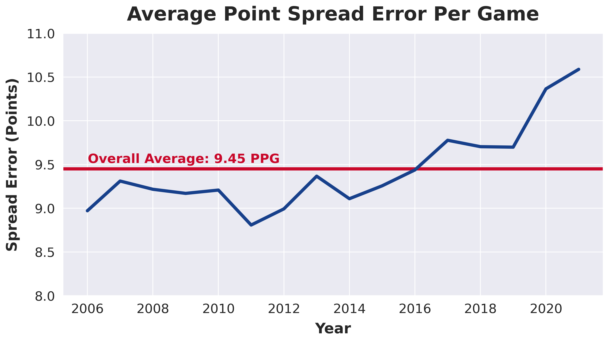

# NBA Betting

>>>Project Demo<<<

## Table of Contents
* [Introduction](#Introduction)
    * [Motivation](#Motivation)
    * [Goals](#Goals)
* [Data Acquisition](#Data-Acquisition)
* [Data Storage and ETL](#Data-Storage-and-ETL)
* [Exploratory Data Analysis](#Exploratory-Data-Analysis)
* [Feature Engineering](#Feature-Engineering)
* [Data Modeling](#Data-Modeling)
    * [Machine Learning + AutoML](#Machine-Learning-+-AutoML)
    * [Deep Learning](#Deep-Learning)
* [Deployment](#Deployment)
* [Next Steps](#Next-Steps)
* [Contact](#Contact)
* [Acknowledgments](#Acknowledgments)

  

# Introduction

## Motivation

Sports Stats - MLB, Sports Game Simulations, Personal Sports League Record Keeping (Papers from Childhood)
NBA - Steph Curry and 2015-2016 Warriors, Why I think NBA is the best league in sports
Investing - Sports Betting as an investment??

## Goals

The main goal of this project is create an automated system that collects data about NBA games and predicts point spreads at a level that is consistently profitable.

### Secondary Goals

* Learn more about the NBA and uncover interesting stats and trends concerning the NBA and betting data surrounding it.
* Acquire new data skills and improve upon my current knowledge.

  

# Data Acquisition

Web Scraping - Scrapy, Splash, Selenium, BeautifulSoup, Chrome Dev Tools (Inspect)
API Calls - 

  

# Data Storage and ETL

Image of Diagram showing data sources and how they connect.
Combining both historic and live data from various sources into a single clean and verified database.

  

# Exploratory Data Analysis

Dataprep.eda for AutoEDA

Interesting Questions:
* Vegas Point Spread vs. Actual Game Spread over time. How has Vegas improved at predicting?
* Biggest Outliers Vegas vs. Actual
* Home vs. Road over time
* Home/Road against the spread over time
* How much is being at home worth over time, Both vegas lines and actual results
* Team Quality vs. Against the Spread results. Are good, average, or bad teams more likely to over-perform the vegas spread?
* Actual Team Record vs. Expected Record, Which is a better predictor of vegas lines and actual results?

### Average Point Spread Error Per Game Over Time

  

# Feature Engineering

  

# Data Modeling

## Machine Learning + AutoML

PyCaret Full Workthrough

### Setup

### Results

## Deep Learning

### Setup

### Results

  

# Deployment

  

# Next Steps

* Improve Models
* Add more data sources.
* Create more useful features.

  

# Contact

Jeff Johannsen - [LinkedIn](https://www.linkedin.com/in/jeffjohannsen/) - jeffjohannsen7@gmail.com

  

# Acknowledgments

## Data

* [Covers](https://www.covers.com/) - Main source of odds data both live and historic.
* [Basketball Reference](https://www.basketball-reference.com/) - Main source of NBA data.

## Images

## Helpful Projects

* [Databall](https://github.com/klane/databall)

## Tools

Python
* Scrapy
* Pandas
* SQLAlchemy
* PyCaret
* Keras
* Tensorflow
* Scikit-Learn
* Flask  

SQL
* Postgres

AWS
* S3
* EC2
* RDS

Docker
Cron/Cronitor
HTML/CSS
Bootstrap

