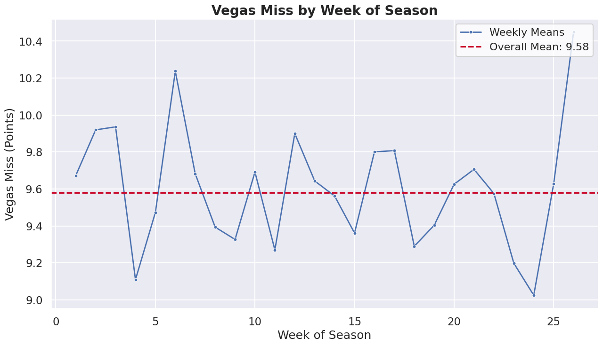
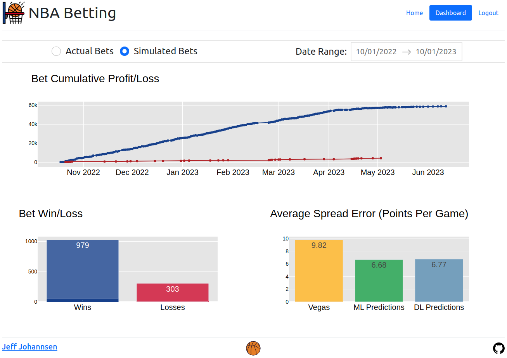

# NBA Betting

> [!NOTE]
> **Two approaches to NBA prediction:**
>
> **This project (NBA Betting)** focuses on *data collection*—aggregating multiple sources where signal comes from combining many weak predictors. Modeling uses AutoML.
>
> **[NBA AI](https://github.com/NBA-Betting/NBA_AI)** focuses on *modeling architecture*—using minimal primary data (play-by-play) with a custom model.
>
> Active development has moved to [NBA AI](https://github.com/NBA-Betting/NBA_AI).

## Table of Contents
- [Introduction](#introduction)
  - [Project Goal](#project-goal)
  - [Motivation](#motivation)
  - [Plan](#plan)
- [Current Goal: Point Spread Prediction](#current-goal-point-spread-prediction)
- [Project Structure](#project-structure)
  - [Data Sourcing and Storage](#data-sourcing-and-storage)
  - [Data Prep and Feature Engineering](#data-prep-and-feature-engineering)
  - [Exploratory Data Analysis](#exploratory-data-analysis)
  - [Modeling](#modeling)
  - [Bet Decisions](#bet-decisions)
  - [Web App and Dashboard](#web-app-and-dashboard)
- [Quick Start](#quick-start)

# Introduction

## Project Goal
Create a **Comprehensive** and **Profitable** System for Predicting the **Outcomes** of NBA Games.

#### Comprehensive Approach
Under the 'comprehensive' aspect, the project will explore and test multiple plausible prediction methods, ensuring an evolving scope and prioritization based on the utility of the results.

#### Profitability Focus
The 'profitable' aspect aims to generate actionable insights for profitable betting decisions.

#### Broad Definition of Outcomes
Initially, the project will focus on predicting the final score margins. In its long-term vision, it could expand to cover other betting domains like over/under and player props, embracing a broad definition of 'outcomes'.

## Motivation
NBA betting uniquely aligns with my interests, knowledge, skills, and goals.

- **NBA Enthusiast:** Following the NBA since 2015, with particular interest in the analytical and financial aspects of the game.
- **Data Science Career:** Focused on practical application, leveraging tools like AutoML for efficient solutions.
- **Sports Analytics Enthusiast:** A lifelong interest in sports analytics, from baseball statistics to managing simulated sports leagues.
- **Investment Background:** Finance education combined with experience applying financial concepts to emerging markets like sports betting.

## Plan
How do we predict the outcome of an NBA game? From a data science viewpoint, the challenge lies in identifying the optimal feature set and designing an effective model architecture.

The vast amount of public data available for NBA games is both a blessing and a challenge: the options are plentiful, but selecting the right ones and managing them effectively is crucial.

### Prediction Frameworks
NBA game predictions can be approached at multiple levels, each functioning independently or as part of a higher-level framework:

1. **Player Prediction Framework:** Focuses on individual player performance, aiming to quantify a player's quality. A simple example is estimating a team's score by summing up the players' average points per game.
2. **Player Interaction and Synergy Framework:** Centers on how players perform in various combinations on the court—how certain player pairings or lineup compositions affect overall team performance.
3. **Team Prediction Framework:** The conventional level for predicting game outcomes, asking how one team compares to another given an even setting.
4. **Game Prediction Framework:** Includes all factors that could impact game results: game location, referee decisions, schedule effects (back-to-back games, travel, rest days), coaching styles, betting trends, line movements, and player availability.

### Data Points
Data acquisition is complicated by the time series nature of sports data. Predictive metrics vary in utility based on the timeframe considered—team history, season-to-date stats, recent performance, or data from the last game. ML models require point-in-time data, which poses challenges in terms of availability and structuring.

| **Raw Data**       | **Traditional Statistics** | **Advanced Statistics** | **Subjective**    | **Other**          |
|--------------------|----------------------------|------------------------|-------------------|--------------------|
| - Play by Play Logs <br>- Game Video <br>- Camera Tracking|- Box Scores <br>- Points, Rebounds, Assists <br>- Win/Loss Records               | - EPM <br>- PER <br>- RAPTOR                  | - Power Rankings <br>- NBA2k Ratings <br>- Social Media Sentiment | - Schedule Effects <br>- Injuries <br>- Referees |

<sub>See also: [GitHub Discussion - Frameworks and Data Sourcing](https://github.com/NBA-Betting/NBA_Betting/discussions/52)</sub>

# Current Goal: Point Spread Prediction
The project focuses on predicting point spreads using team-level statistics. This is the most common betting market and provides a clear benchmark.

Vegas lines predict game winners and margins with an average miss of ~9 points per game. The graph below shows this discrepancy over time.

Vegas sets a high bar—they have extensive resources and data. The public Vegas lines also serve as both a benchmark and a feature for modeling.


# Project Structure
The project is built around a SQLite database with data processing, feature engineering, model training, and prediction pipelines. A Flask web app and Dash dashboard provide the interface.


<sub>Note: This diagram reflects an earlier version of the project. See [ARCHITECTURE.md](ARCHITECTURE.md) for the current implementation.</sub>

## Data Sourcing and Storage
Data collection is the most time-intensive part of the project. The data falls into three categories:
1. **Game Data:** Dates, times, teams, and scores of games.
2. **Betting Market Data:** Betting lines and odds.
3. **Feature Data:** Statistics and metrics used for predictions.

While acquiring current data is relatively straightforward, the real challenge lies in sourcing historical data for training and testing models.


<sub>Note: This diagram reflects an earlier version. See [ARCHITECTURE.md](ARCHITECTURE.md) for current data sources.</sub>

## Data Prep and Feature Engineering

<sub>Note: This diagram reflects an earlier version. See [ARCHITECTURE.md](ARCHITECTURE.md) for current ETL details.</sub>

The ETL pipeline prepares data for modeling. The main steps:
1. **Loading Data:** Retrieval of data from games and raw features tables.
2. **Initial Feature Engineering:** Adjusting raw metrics before merging, like transforming points per game into relative league averages and rankings.
3. **Merging Data:** Combining games and feature data into a single record for each game, with a unique game_id as the primary key.
4. **Post-Merge Feature Engineering:** Creating game-level features after merging, such as differences in team statistics or rest days.
5. **Saving Records:** Storing each game's data as a record in the all_features_json table, which includes a game_id and a JSON object with all features for that game.

Important considerations:
- The all_features_json table integrates an extensive feature list into a relational database framework, converted to a DataFrame for processing.
- Avoiding data leakage is critical—meticulously manage dates for data merging (e.g., using the previous day's data) and calculate rolling features based on correct historical games.

## Exploratory Data Analysis

### Vegas Spread Accuracy
Analysis of Vegas spread accuracy across ~23,000 games from 2006-2026 shows the average miss has increased over time—from 9.12 points in the Traditional Era (2006-2016) to 10.49 points in the Modern Variance era (2020-2026). This trend coincides with the three-point revolution and increased game-to-game variance in the NBA.


Postseason games show slightly higher prediction error (~10.18 points) compared to regular season (~9.64 points), likely due to smaller sample sizes and higher-stakes adjustments.



## Modeling

Two approaches are explored: AutoML for quick iteration on tabular data, and a custom architecture for time-series modeling (see [NBA AI](https://github.com/NBA-Betting/NBA_AI)).

The project uses [AutoGluon](https://auto.gluon.ai/) for automated machine learning. AutoGluon trains and ensembles multiple models, handling feature engineering and hyperparameter tuning automatically.

### AutoML


Consistently outperforming Vegas lines remains a challenge. This is not unexpected given the complexity of the task and the additional hurdle of overcoming the vig (the bookmaker's charge).

### Custom Model Architecture
The journey towards a custom model architecture initially centered around a traditional data science approach – combining various features from different sources. While this approach aligns with conventional methods and may still hold potential, it faces several challenges, including complex data collection and potentially mirroring the algorithms used by line setters. To move beyond these limitations and add an element of innovation, I am exploring a second approach, which includes the following key requirements:


- **Time Series Data Inclusive:** A focus on incorporating the sequential nature of events in games and across seasons, recognizing the significance of order and timing in the NBA.
- **Minimal Data Collection:** Streamlining data sourcing to the essentials, aiming for maximum impact with minimal data, thereby reducing time and resource investment.
- **Wider Applicability:** Extending the scope to cover more comprehensive outcomes, moving beyond standard predictions like point spreads or over/unders.
- **Advanced Modeling System:** Developing a system that is not only a learning tool but also potentially novel compared to the methods used by odds setters.
- **Minimal Human Decisions:** Reducing the reliance on human decision-making to minimize errors and the limitations of individual expertise.

#### Go check out this new approach in my project [NBA AI](https://github.com/NBA-Betting/NBA_AI).

## Bet Decisions
This section applies model predictions to betting decisions. The process combines model outputs with current betting lines to identify potential value bets.

A simple bankroll management module tracks bet sizing and account balance using Kelly Criterion principles.


## Web App and Dashboard
A Flask web app displays games and predictions. The Dash dashboard shows betting performance metrics.




# Quick Start

> [!WARNING]
> **Project Status:** This project is on hiatus and not actively maintained. It may require minor bug fixes to run. Feel free to [open an issue](https://github.com/NBA-Betting/NBA_Betting/issues) if you encounter problems—I monitor issues periodically.

> [!CAUTION]
> **API Rate Limits:** The data pipeline calls the NBA Stats API, which has rate limits. Daily updates are fine, but full season backfills can take hours and make many API requests. Please be respectful of the API. Check the [Releases](https://github.com/NBA-Betting/NBA_Betting/releases) page for pre-collected data to reduce API usage.

```bash
# Clone the repository
git clone https://github.com/NBA-Betting/NBA_Betting.git
cd NBA_Betting

# Create virtual environment
python -m venv .venv
source .venv/bin/activate  # On Windows: .venv\Scripts\activate

# Install dependencies (choose one)
pip install -e ".[all]"    # Full install with ML, web app, and dev tools
pip install -e "."         # Core only (data collection and ETL)
pip install -e ".[ml]"     # Core + AutoGluon for modeling
pip install -e ".[web]"    # Core + Flask/Dash web app

# Set up environment variables
cp .env.example .env
# Edit .env with your ODDS_API_KEY (optional, for live odds)

# Run the data pipeline
python update_data.py

# Launch the web app
python start_app.py
```

### Data Pipeline

The `update_data.py` script runs the full pipeline: data collection → ETL → predictions.

```bash
python update_data.py                    # Daily update (yesterday/today/tomorrow)
python update_data.py --season 2024      # Backfill full season
python update_data.py --date 2025-01-15  # Fix specific date
python update_data.py --collect-only     # Skip ETL and predictions
```
