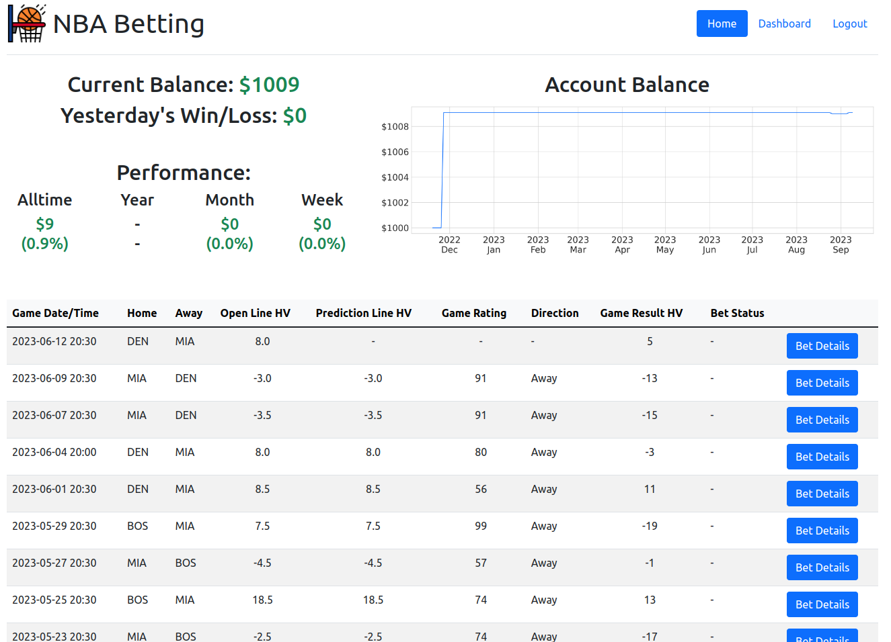

# NBA Betting

## Table of Contents
* [Introduction](#Introduction)
* [Data Engineering](#Data-Engineering)
* [Exploratory Data Analysis](#Exploratory-Data-Analysis)
* [AutoML](#AutoML)
* [Bet Decisions](#Bet-Decisions)
* [Web App and Dashboard](#Web-App-and-Dashboard)

  

# Introduction

## Goal

Create a **Profitable** and **Comprehensive** System for Predicting the **Outcomes** of NBA Games.

## Motivation

NBA betting sits at an intersection of my interests, knowledge, skills, and goals which makes it a project that is both beneficial and exciting for me. A lucky combination!
* NBA - Huge fan of professional basketball. Especially since 2015. Main focus is on the analytical and financial aspects of the league.
* Data Science - Past Education and Current Career Focus. 
* Sports Stats - Lifelong interest starting with baseball and moving into other sports.
* Investing - Education in Finance - Sportsbetting as an investment option.

## Plan

### How to predict a NBA game result?
1. **Team Prediction Framework** - Combination of ML/DL and traditional algorithms used to predict the performance of teams as a whole.
2. **Player Prediction Framework** - Combination of ML/DL and Traditional Algorithms used to predict the performance of individual players.
3. **Player Interaction and Synergy Framework** - Focused on understanding and predicting the performance of players in various combinations on and off the court.
Example: How does Steph Curry perform when Draymond Green is on the court vs off the court? 
4. **Game Prediction Framework** - Betting market data and other misc predictors of game outcomes.
5. **Prediction Framework Integration** - Combining the 4 prediction frameworks into a single bet management system.

### Data Point Examples

|             |             |             |
| ----------- | ----------- | ----------- |
|All in One Team and Player Advanced Stats<ul><li>RAPTOR - FiveThirtyEight</li><li>DARKO - The Athletic</li><li>LEBRON - BBall Index</li><li>EPM - Dunks and Threes</li></ul>|Long-Run Team Quality and Opponent Quality<ul><li>Traditional Box Score Stats</li><li>Advanced Stats</li><li>Elo Ratings</li><li>Power Rankings</li></ul>|Recent Team Performance<ul><li>Last 3, 5, 10, 20 Days</li><li>Game Results</li><li>Traditional Stats</li><li>Advanced Stats</li><ul>|
|Injuries, Rest, Fatigue<ul><li>Estimated Performance % for Players - Injury % and Fatigue %</li><li>Schedule Effects - Back2Backs, 3 Games in 4 Nights</li></ul>|Game Location<ul><li>Home vs. Road Adjustment</li><li>Altitude Effects for Denver and Utah</li></ul>|Seasonal Effects<ul><li>Tanking for Draft Position</li><li>Playoff Seed Positioning</li></ul>|

  

# Data Engineering

## Data Acquisition and Storage

## ETL

  

# Exploratory Data Analysis

## Average Vegas Point Spread Error Per Game Over Time

There is a possibility for improvement over the vegas lines for NBA games. The average miss for the vegas line vs the actual game result is over 9 points since 2010!

  

# AutoML

  

# Bet Decisions

  

# Web App and Dashboard

### Link >>> [http://nba-betting.us/](http://nba-betting.us/)  
** Publically available data is for example only. It does not reflect actual predictions or bet recommendations at this time.

